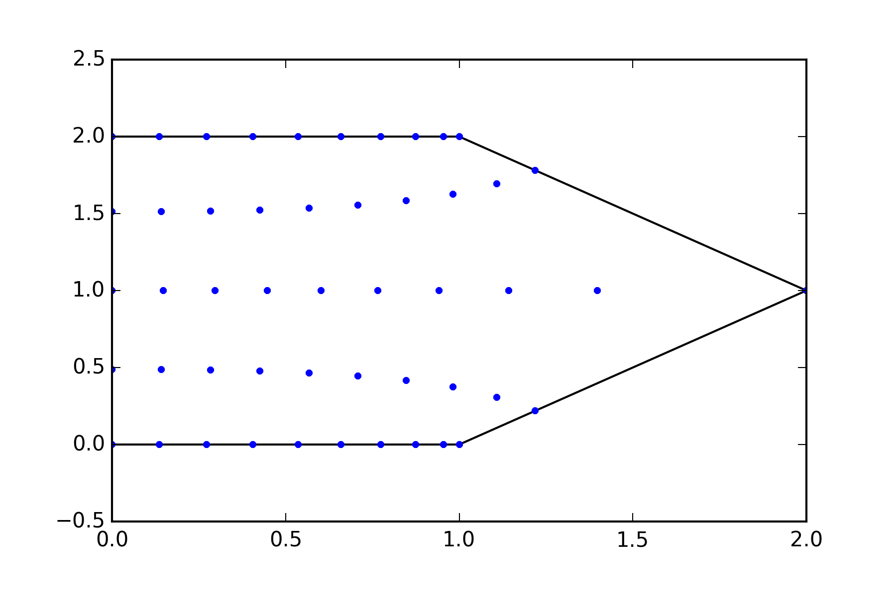
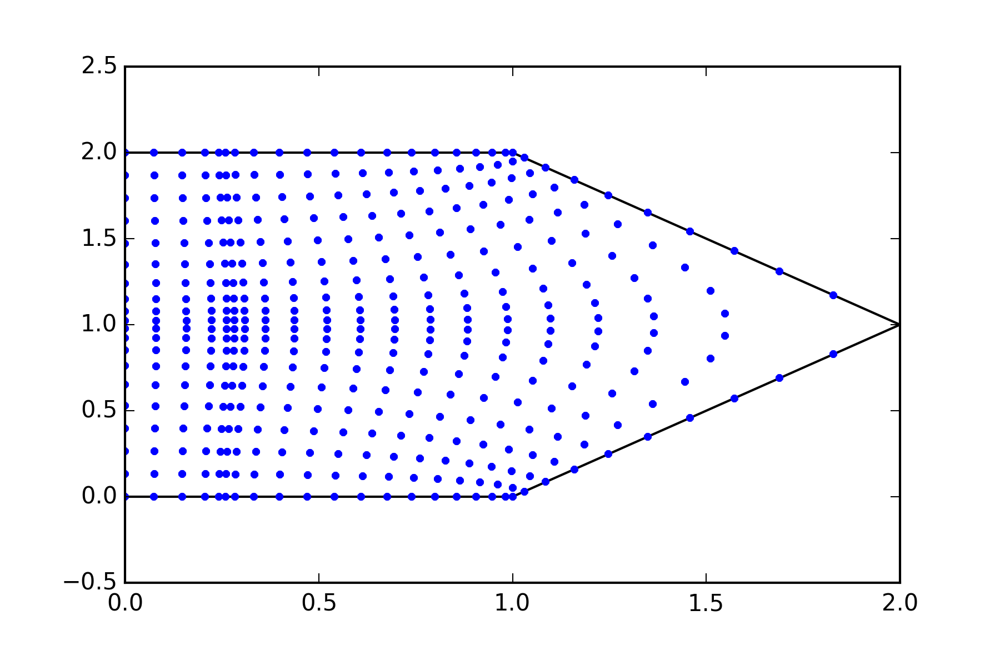

# pygridgen
[](https://travis-ci.org/hetland/pygridgen)

A Python interface to Pavel Sakov's C-based Gridgen Orthogonal Grid
Generation Package

## Components

  + **simple GUI interface** - The GUI interface uses native matplotlib
    widgets for even more portability.
  + **arbitrary number of corners** - More corners means more complicated
    domains.  Great for domains with bays, estuaries, and other complicated
    features.
  + **a single orthogonal grid as a result** - Whites whiter!
    Brights brighter!

## Install

We are working on packaging using Bento or binstar. When that happens
it'll be very easy to install. For now, here's a *very* rough outline.

  + cd external/nn; ./configure ; make install
  + cd external/csa; ./configure ; make install
  + cd external/gridutils; ./configure ; make install
  + cd external/gridgen; ./configure ; make shlib
  + cd pygridgen; python setup.py install

More details on installation in the documentation:

 + [Linux](doc/INSTALL_Linux.md)
 + [Mac OS X](doc/INSTALL_OSX.md)

## Dependencies:
  + numpy
  + matplotlib
  + pyproj or basemap

## Examples

### Basic Example
```python

import matplotlib.pyplot as plt
import pygridgen
x = [0, 1, 2, 1, 0]
y = [0, 0, 1, 2, 2]
beta = [1, 1, 0, 1, 1]

grid = pygridgen.grid.Gridgen(x, y, beta, shape=(10, 5))

fig, ax = plt.subplots()
ax.plot(x, y, 'k-')
ax.plot(grid.x, grid.y, 'b.')
plt.show()
```


### Example with focus
Note that `add_focus_x` means focus *along* the x axis, not
*at* a specific x-postion.

```python
x = [0, 1, 2, 1, 0]
y = [0, 0, 1, 2, 2]
beta = [1, 1, 0, 1, 1]

focus = pygridgen.grid.Focus()
focus.add_focus_x(xo=0.5, factor=3, Rx=0.2)
focus.add_focus_y(yo=0.75, factor=5, Ry=0.1)
grid = pygridgen.grid.Gridgen(x, y, beta, shape=(20, 20), focus=focus)

fig, ax = plt.subplots()
ax.plot(x, y, 'k-')
ax.plot(grid.x, grid.y, 'b.')
plt.show()
```


